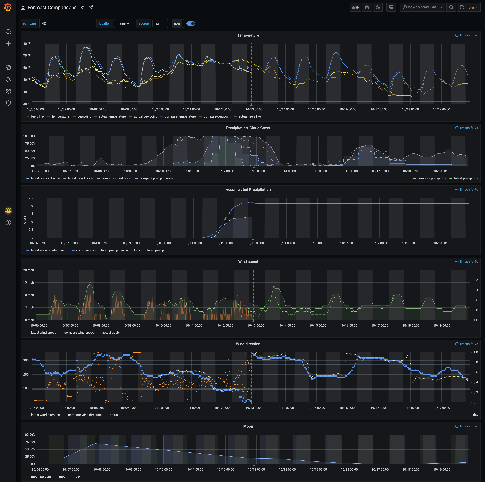

# Weather2InfluxDB

Weather2InfluxDB is a tool to store forecast data from multiple
sources in InfluxDB.

#### Currently supported sources:
- National Weather Service (NWS)
- VisualCrossing
- TheGlobalWeather
- No other sources planned at this time, due to not meeting the below
criteria (7 day hourly forecast, reasonably priced or free)
- Open an issue if you find a worthy source!

## Usage:

### Either... Install a binary
- Download a binary from the latest [Release][release]
- `chmod +x` the binary

### Or... Build from source
- Clone this repo
- [Install Go][install-go]
- `cd weather2influxdb`
- `go build`

### To run:
- Create a config file named `weather2influxdb.yaml` referencing the [example][config-example]
- Place the config in `./config/`, `./`, or `/usr/local/etc/`
- Run the binary: `./weather2influxdb`

## Grafana Dashboard
I've included my [grafana dashboard definition](grafana/dashboard.json) in the repo. 
Here is a screenshot of what it looks like when configured correctly.
I use this dashboard daily for my local weather forecast.

## Rationale behind included/planned sources:
I was looking for a replacement for DarkSky, who were bought by
Apple and will be retiring their API at the end of 2021.
DarkSky had the best forecasts and a generous free version,
with 7 days of forecast data available.

I used the DarkSky data to power my own visualizations of my
local forecast in Grafana. I find my Grafana graphs of forecast
data much more intuitive than any weather app or website out there.
I display the 7 day forecast for temps, precip, wind, and clouds,
on the same graph with 7 days of actual data history from my
Ambient Weather personal weather station, and also the forecast
from 24 hours previous.

So when I went looking for replacements I needed these features:
- At least 7 days of HOURLY forecast data. Daily highs and lows
are not very interesting to look at in a graph.
- I preferred Free APIs or APIs allowing at least 1500 forecasts
per month, as I only made <200 calls/day to DarkSky, and paying
large amounts for my personal forecast dashboard is just silly.
    - This is why visualcrossing is a supported source,
    because their free tier supports 250 forecasts/day.
- I also considered Low-cost APIs.
    - Theglobalweather is a pay-as-you-go api that you only pay 
    a fraction of a cent per call, which is much better than paying
    tens or hundreds of US dollars a month.

### TBD:
- attach screenshots of my forecast dashboards

[release]: https://github.com/tedpearson/weather2influxdb/releases
[config-example]: https://github.com/tedpearson/weather2influxdb/blob/master/config/weather2influxdb.example.yaml
[install-go]: https://golang.org/dl/